# Design Improvement: Brainbots Brand Guidelines

## TL;DR

The largest mismatch was hierarchy: Brainbots used similarly sized headings and balanced two-column blocks, while VANTA deliberately gives one typographic element most of the viewport and lets supporting information sit much smaller around it. The revision adopts that uneven, editorial distribution from Typography through Assets.

Final verification used current 1440px captures for all six revised sections. Responsive checks at 390px, 744px, and 1024px found no horizontal overflow; the Moodboard resolves to 2, 3, and 4 columns at the configured viewport thresholds.

## Current State

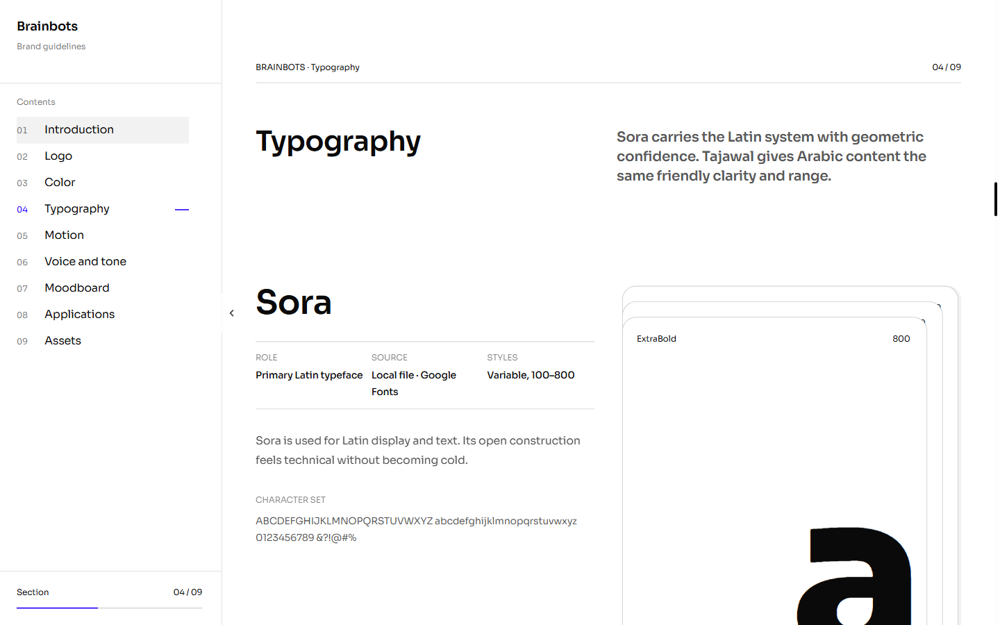

*The previous layout split the intro into two equal columns and gave the family information and weight sheets similar visual importance.*

## Improvement Ideas

### 1. Make the type family the dominant object

Use a large single-column section title, then let the primary family name occupy the left half while tall vertical weight sheets occupy the right. Move descriptive and character-set content below the dominant specimen so it does not compete above the fold.

**Inspired by:**

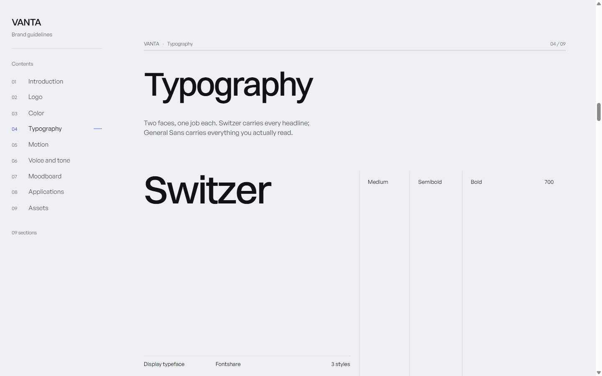

*VANTA — one dominant family name, restrained metadata, and tall weight columns. [Live reference](https://vessa.design/brand/vanta).*

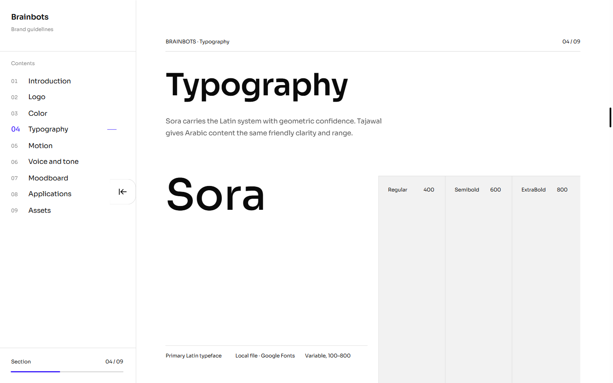

*Brainbots — Sora now owns the left field while the weight sheets carry the right.*

**Why this works:** The reader understands the hierarchy before reading labels. The contrast between the oversized family name and very small metadata makes the page feel like a brand specimen rather than a settings screen.

```text
┌────────────────────────────────────────────────────┐
│ TYPOGRAPHY                                         │
│ Short supporting statement                        │
│                                                    │
│ SORA                 │ Regular │ Semibold │ Extra │
│                      │         │          │ Bold  │
│ role · source · set  │         │          │       │
└────────────────────────────────────────────────────┘
```

### 2. Use large stages and external captions

Motion examples and voice principles should be large, quiet rectangles. Labels and explanations sit outside the visual stage rather than filling it with interface chrome.

**Inspired by:**

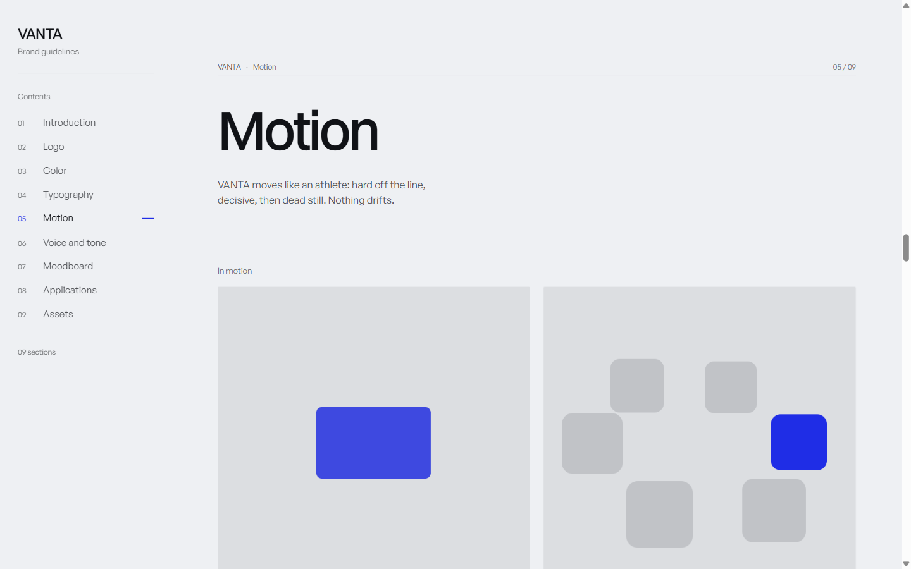
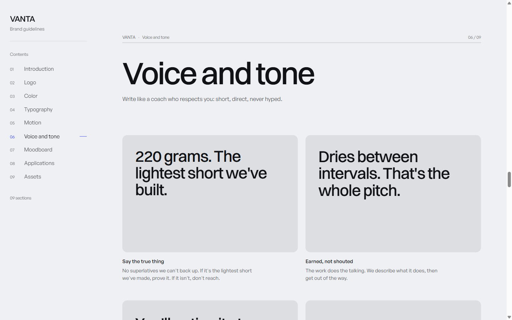

*VANTA — two large motion stages and two-up statement panels with captions below. [Live reference](https://vessa.design/brand/vanta).*

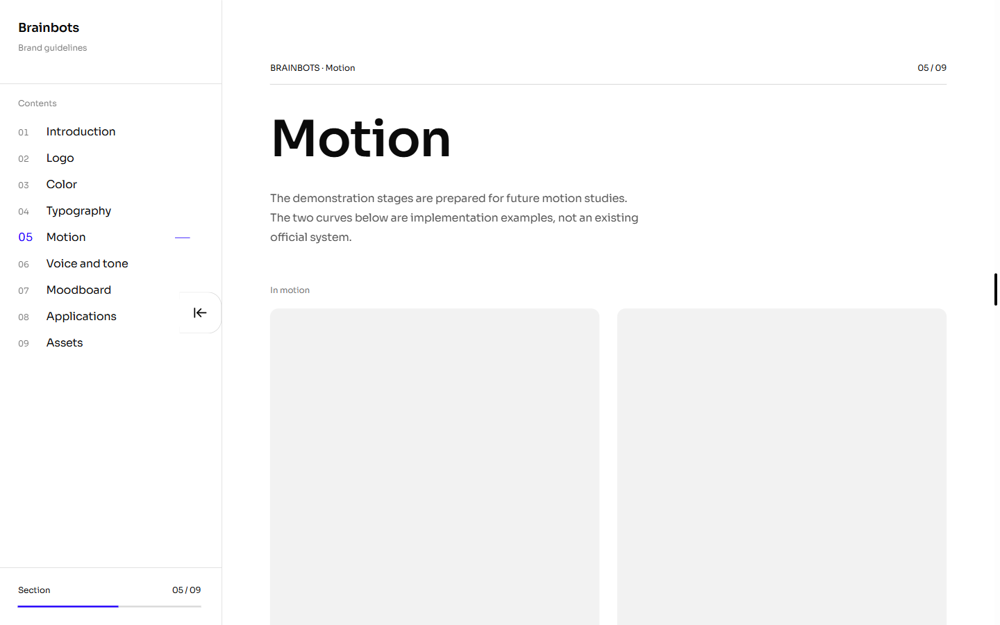
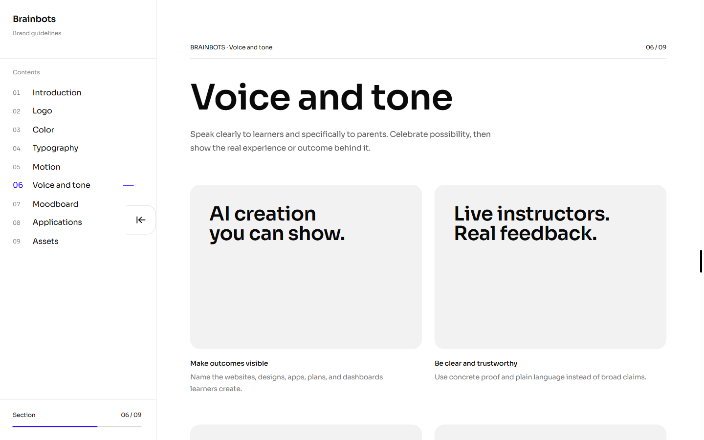

*Brainbots — the same stage-led hierarchy with empty motion demonstrations and configurable voice principles.*

**Why this works:** Empty or simple content still feels intentional because the stage itself carries visual weight.

```text
┌──────────────────┐  ┌──────────────────┐
│                  │  │                  │
│   empty stage    │  │   empty stage    │
│                  │  │                  │
└──────────────────┘  └──────────────────┘
Label + explanation   Label + explanation
```

### 3. Present imagery on a consistent editorial grid

Keep Moodboard in shortest-column masonry, but align its controls and opening edge to the same content grid. Applications use three equal 4:3 presentation mats, with small labels beneath.

**Inspired by:**

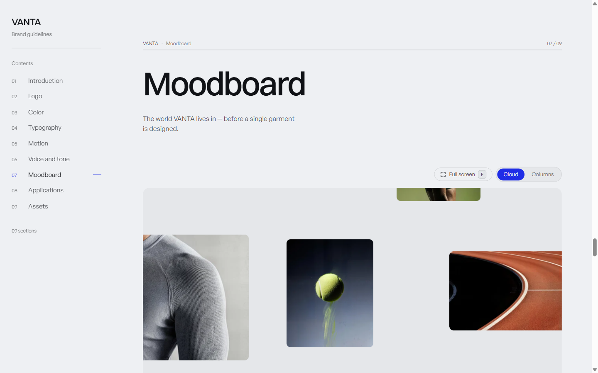
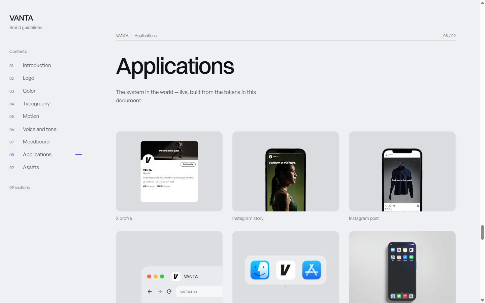

*VANTA — a wide visual field followed by consistent three-column application mats. [Live reference](https://vessa.design/brand/vanta).*

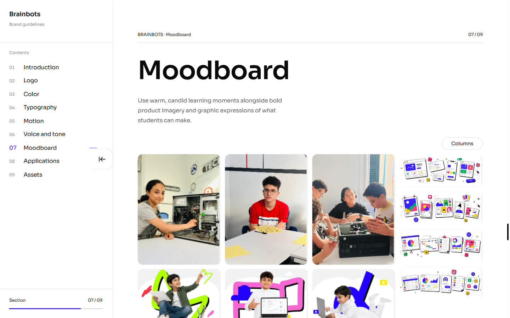
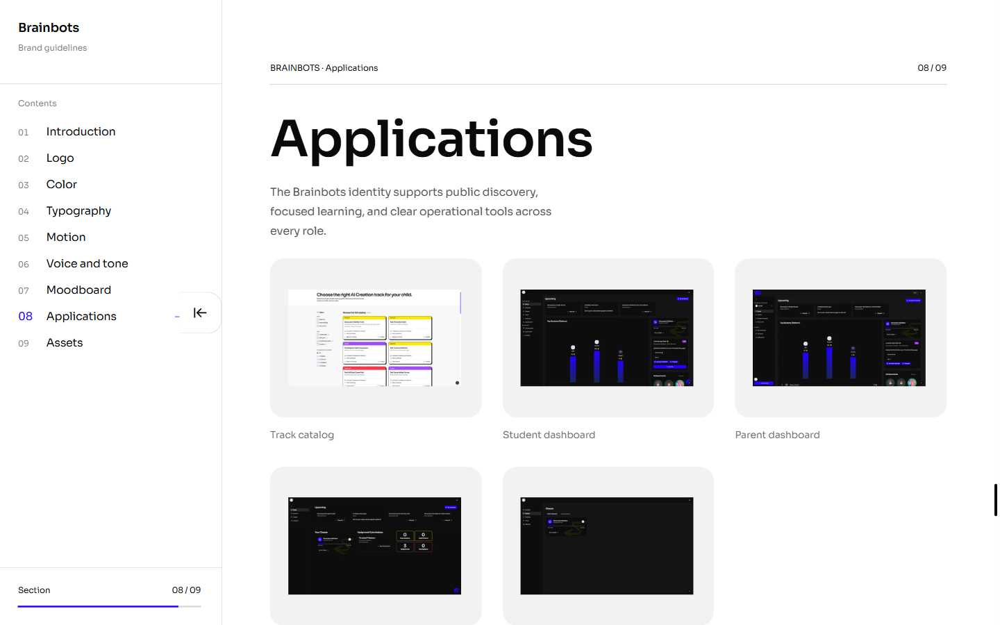

*Brainbots — Columns-only masonry and equal application mats use the same opening grid.*

**Why this works:** Images feel like one system even when their source dimensions and subjects differ.

```text
[Columns]
┌──────┐ ┌──────┐ ┌──────┐ ┌──────┐
│      │ │      │ │      │ │      │
└──────┘ └───┐  │ └──────┘ │      │
             └──┘          └──────┘
```

### 4. Give asset groups their own vertical chapters

Use a large Assets intro and a right-aligned complete-pack action. Each download category gets a long vertical band with flat rows and restrained metadata rather than compact card stacks.

**Inspired by:**

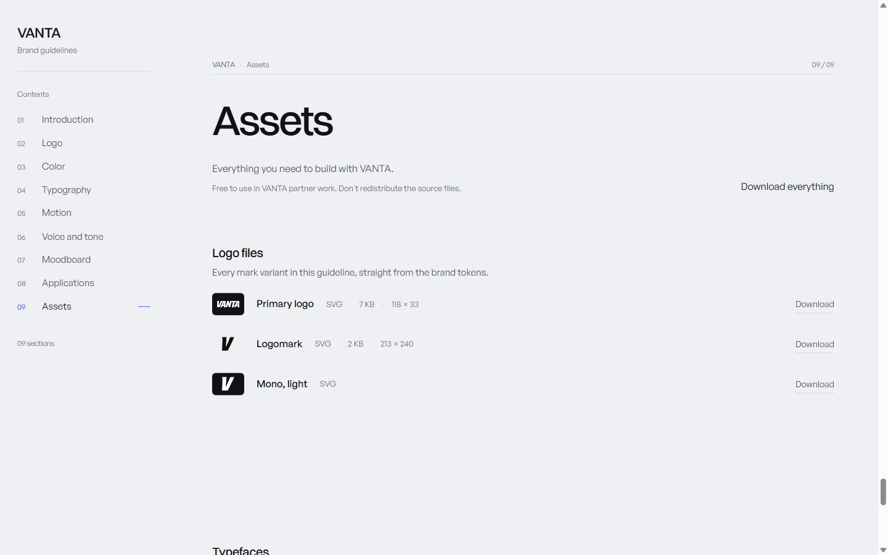

*VANTA — large introduction, quiet download action, and widely separated asset categories. [Live reference](https://vessa.design/brand/vanta).*

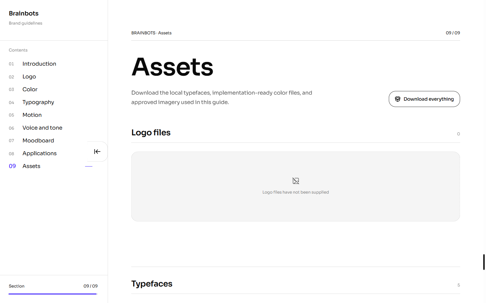

*Brainbots — local files, the logo empty state, and the complete-pack action now read as one editorial chapter.*

**Why this works:** The page remains scannable even when each future brand adds many files.

```text
ASSETS                              [Download everything]

Logo files                                             0
────────────────────────────────────────────────────────
Empty state / rows

Typefaces                                              5
────────────────────────────────────────────────────────
File name · type                              Download
```

## What's Working

- The nine-section information architecture already matches the reference well.
- Brainbots colors, content, media, and downloadable files remain fully data-driven.
- The sidebar, section numbering, and aligned rules create a strong document frame.
- Null logo assets and intentionally empty motion stages communicate incomplete content without breaking the layout.

## All References

- [VANTA live brand-guidelines reference](https://vessa.design/brand/vanta) — Typography, Motion, Voice and tone, Moodboard, Applications, and Assets.
