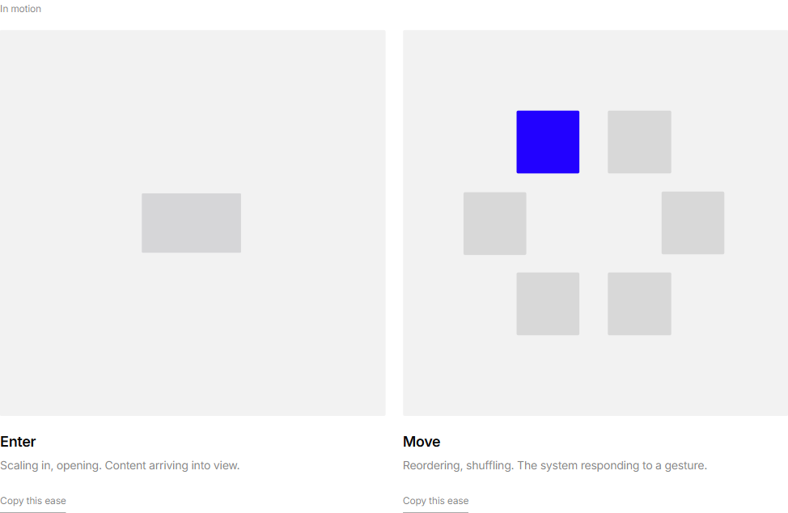
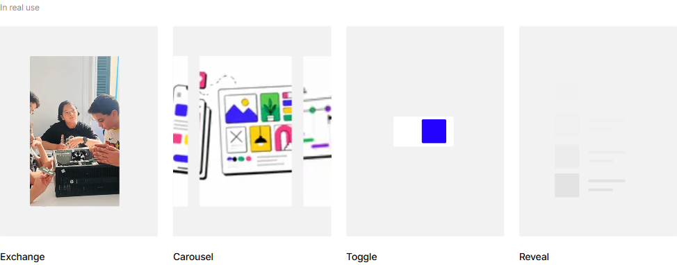
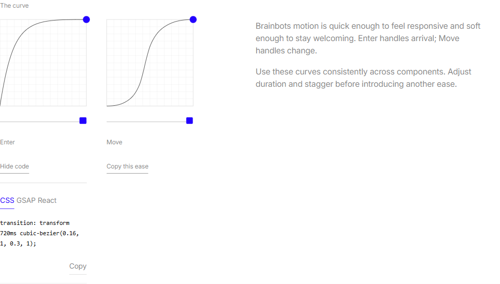
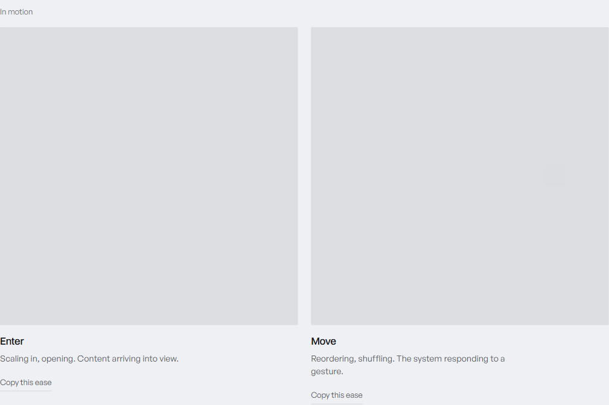

# Design Improvement: Brainbots Motion Section

## TL;DR

The Motion loops continue regardless of scroll position. Move now has a tighter 25ms stagger, Carousel has a visible gutter between slides, and Reveal uses one neutral gray with balanced vertical breathing room.

The expanded curve controls keep CSS, GSAP, and React in a compact 4px-gap tab group. The muted Copy action now sits in its own right-aligned row below the code output.

## Current State


*The revised primary demonstrations at 1440px.*


*Exchange, Carousel with both neighboring image edges visible around the active slide, Toggle, and image-free Reveal placeholders.*


*Compact format tabs with Copy placed below the code output.*

## Improvements Applied

### 1. Keep every loop continuous

Viewport observers were removed from the two main demonstrations, all four examples, and the curve previews. Animations no longer restart or catch up when the user scrolls back.

```text
on screen  ---- animation timeline ---->  off screen  ---- same timeline ---->
```

### 2. Refine the primary demonstrations

Enter now moves between 60% and 100% scale, reducing the disparity between states. Move uses a tighter oval, tiles that are roughly 20% smaller, an 840ms configured transition, staggered followers, and a one-second still period.

**Inspired by:**


*VANTA - compact geometry surrounded by generous negative space. [Web]*

```text
       square     square
  square               accent
       square     square
```

### 3. Make the examples read as distinct gestures

Exchange uses mirrored holds and transitions. Carousel gives its active image the same measured width as Exchange, keeps both neighboring edges visible even while a slide is settled, and clips only at the shaded stage boundary. Reveal replaces imagery with neutral skeleton placeholders, uses only the shared stage gray, and holds a 63px structural inset at both the top and bottom on the verified desktop layout.

```text
Exchange: A [hold] -> B [hold] -> A
Carousel: 1 [hold] -> 2 [hold] -> 3 [hold] -> 1
Reveal:   placeholder rows enter with configured stagger
```

## What's Working

- Every demonstration stage remains borderless.
- Move followers begin only 25ms apart.
- Format-tab gaps measure approximately 4px.
- Exchange and Carousel image widths differ by less than 0.02px in the verified desktop layout.
- A settled carousel slide leaves roughly 25px of the previous image and 40px of the next image visible.
- Copy sits approximately 17px below the code output.
- Move tiles retain more than 6px of clearance through the sampled staggered shift.
- Exchange and Carousel resolve the configured Move ease; Toggle resolves Enter.
- Reveal resolves the configured Enter ease.
- The carousel's duplicated first slide makes its looping reset visually seamless.
- Reduced-motion mode remains static and legible.

## All References

- [Current] `references/current-motion-revision.png`
- [Current] `references/current-motion-examples.png`
- [Web] VANTA brand guidelines: https://vessa.design/brand/vanta
- [Web] `references/vanta-primary-motion.png`
